#  ShopSphere

A Flutter-based eCommerce application that delivers a seamless online shopping experience with secure authentication, product browsing, cart management, order processing, and profile management. Powered by the DummyJSON API and Firebase services, ShopSphere provides a modern and responsive shopping platform with a clean user interface.

## Features

*  User Authentication (Login, Signup & Password Reset)
*  Browse Products by Categories
*  Real-time Product Search
*  Product Reviews and Ratings
*  Add, Remove, and Update Cart Items
*  Order Summary and Order Management
*  Delivery Address Management
*  User Profile and Account Management
*  Firebase Authentication & Firestore Integration
*  Riverpod State Management
*  Responsive and Modern UI Design

## Tech Stack

* Flutter
* Dart
* DummyJSON API
* Firebase Authentication
* Cloud Firestore
* Riverpod
* HTTP Package

## Screenshots

<table>
 <tr>
  <td>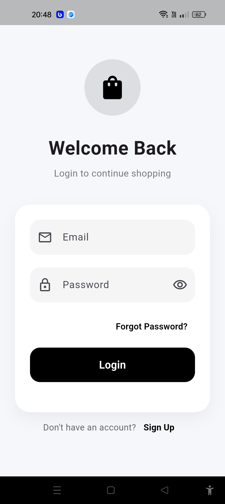</td> 
  <td>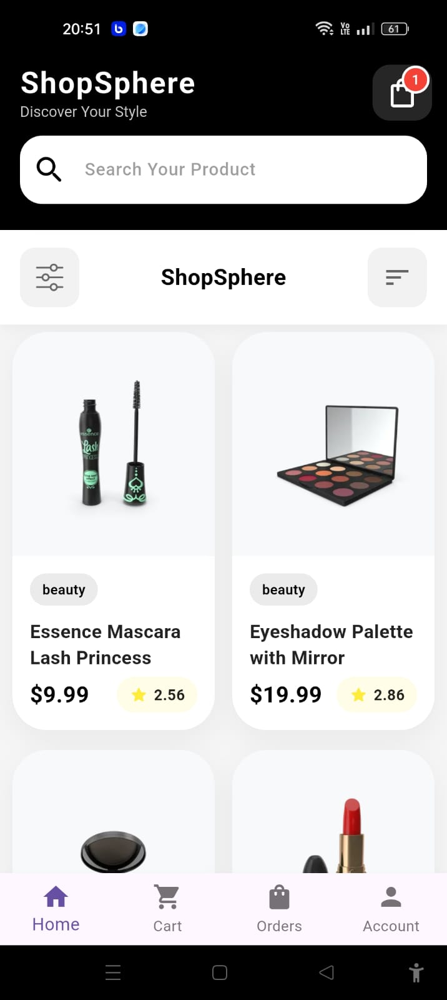</td> 
  <td>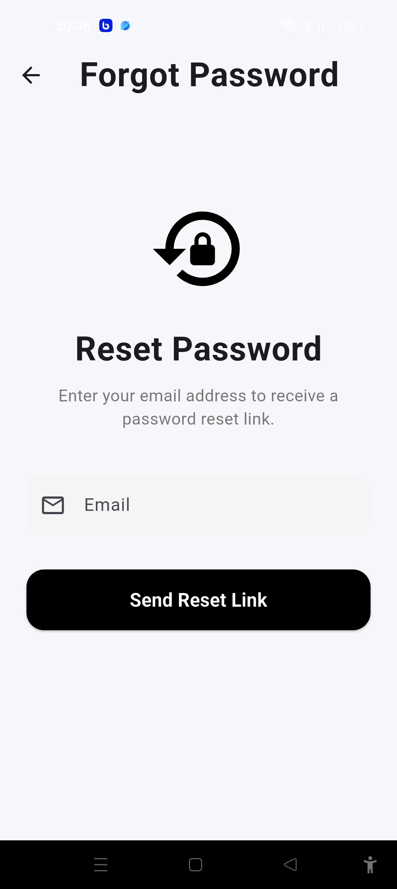</td> 
  </tr> 
  <tr> 
  <td>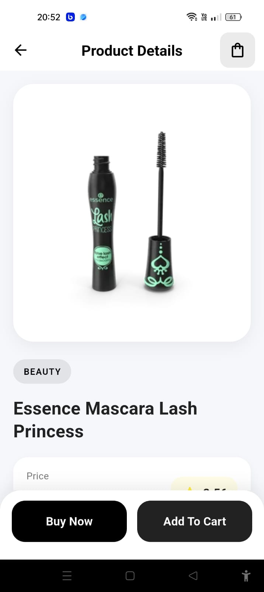</td>
   <td>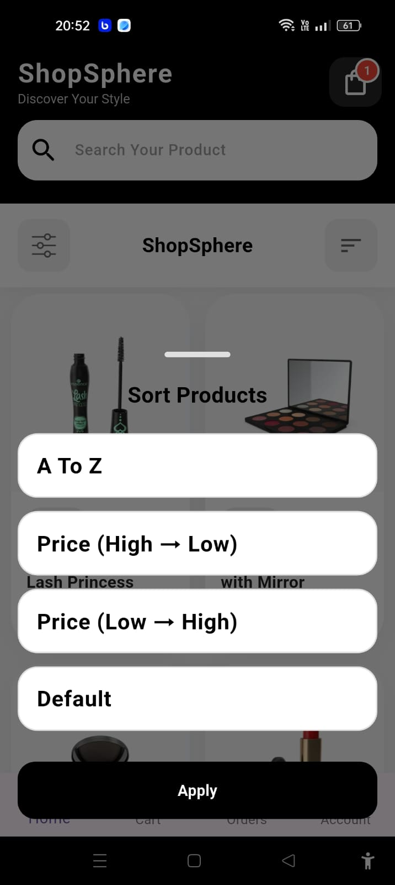</td> 
   <td>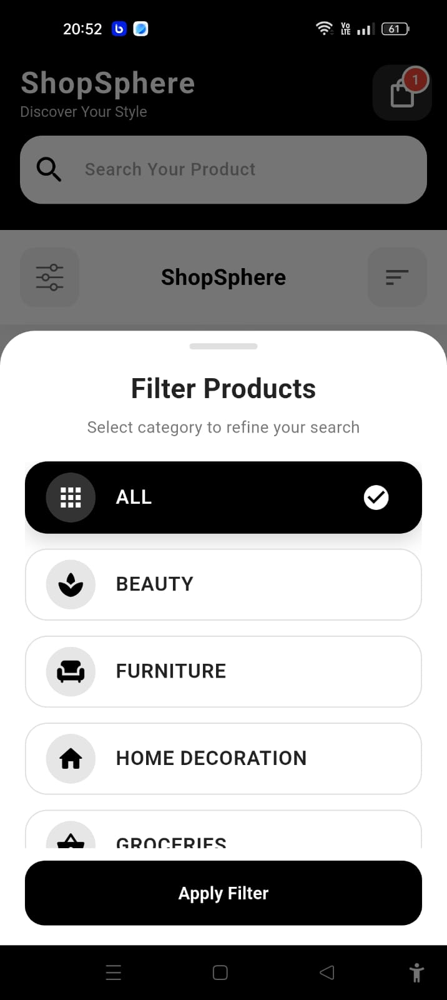</td>
    </tr> 
    <tr> <td>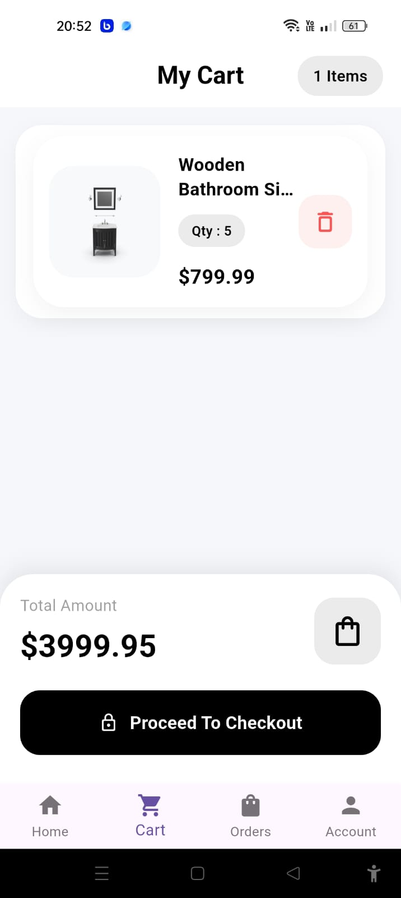</td> 
    <td>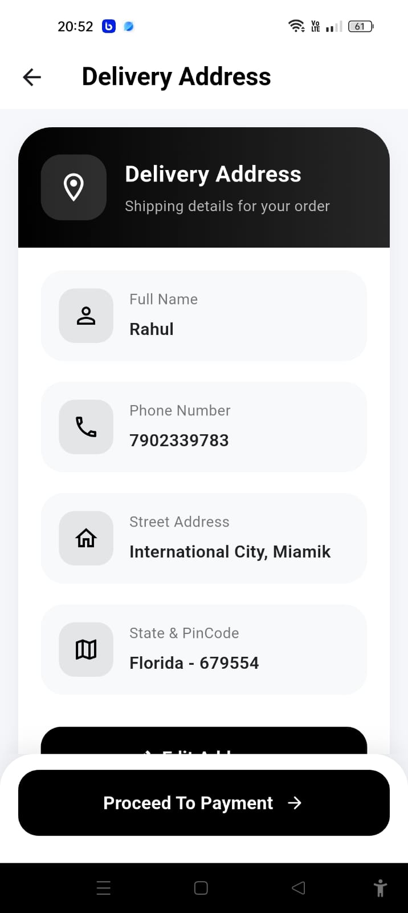</td>
     <td>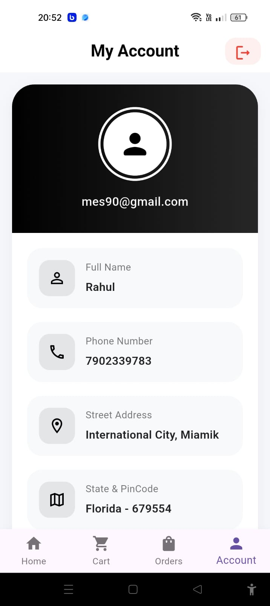</td>
      </tr> 
      <tr> <td>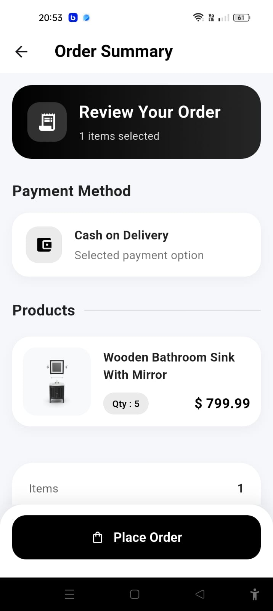</td> 
      <td>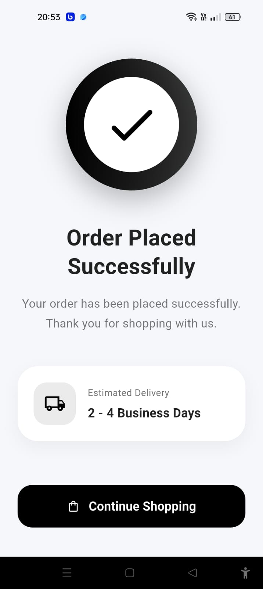</td> 
      <td>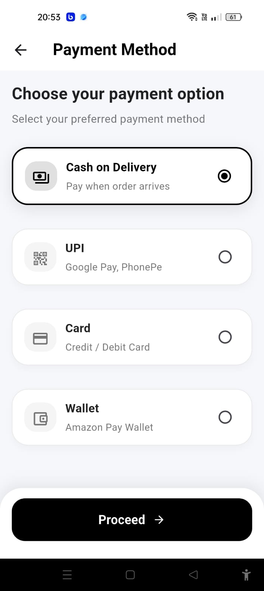</td>
       </tr> 
       <tr> <td>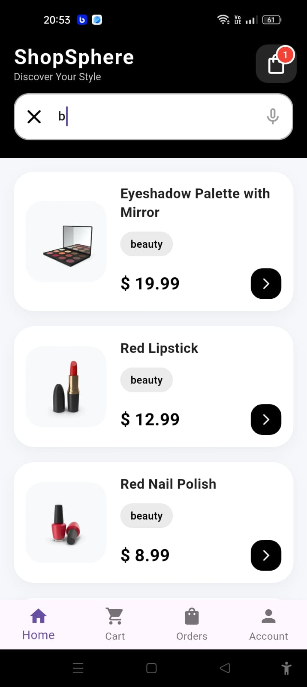</td> 
       <td>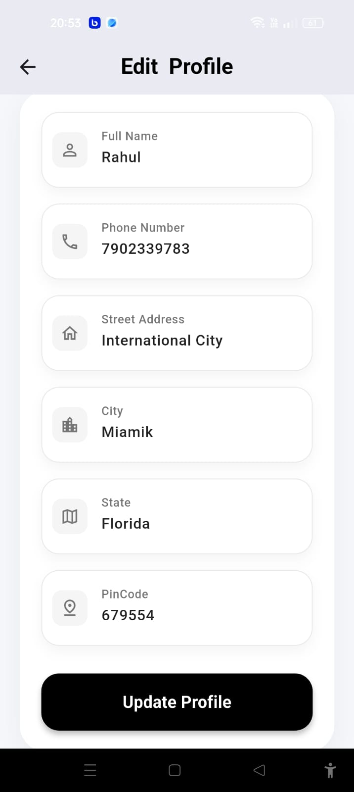</td> 
       <td>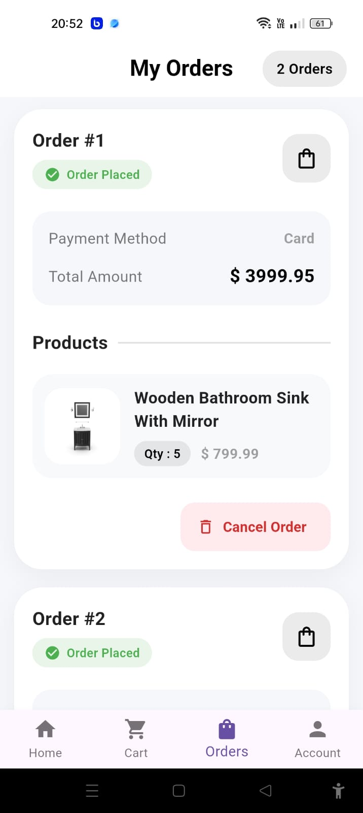</td> 
       </tr> 
       </table>

## Project Structure

```text
lib/
│
├── main.dart
├── const.dart
│
├── models/
│   ├── products.dart
│   └── reviews.dart
│
├── riverpod/
│   ├── auth_riverpod.dart
│   ├── category_riverpod.dart
│   └── firestore_riverpod.dart
│
├── screens/
│   ├── account_screen.dart
│   ├── cart_screen.dart
│   ├── delivery_address_screen.dart
│   ├── forgot_password_screen.dart
│   ├── home_screen.dart
│   ├── login_screen.dart
│   ├── main_screen.dart
│   ├── order_success_screen.dart
│   ├── order_summery_screen.dart
│   ├── ordered_pdt_screen.dart
│   ├── payment_method_screen.dart
│   ├── product_screendetails.dart
│   └── sighup_screen.dart
│
├── services/
│   ├── api_services.dart
│   ├── auth_services.dart
│   ├── dummy_apiservices.dart
│   ├── firestore_services.dart
│   └── order_service.dart
│
└── widgets/
    ├── account_form_widget.dart
    ├── cart_card.dart
    ├── confirmation_dialog.dart
    ├── content.dart
    ├── filter.dart
    ├── home_widget.dart
    ├── list_tile.dart
    ├── loading_widget.dart
    ├── payment_widget.dart
    ├── permission_widget.dart
    ├── product_card.dart
    ├── product_list.dart
    ├── quantity_widget.dart
    ├── review_widget.dart
    ├── search_widget.dart
    ├── sort.dart
    └── textfield_widget.dart
```

## Installation

### 1. Clone the repository

```bash
git clone https://github.com/shiyascholayil/shopsphere.git
```

### 2. Navigate to the project

```bash
cd shopsphere
```

### 3. Install dependencies

```bash
flutter pub get
```

### 4. Run the application

```bash
flutter run
```

## API

This project uses the DummyJSON API for product data and Firebase services for authentication and data management.

## Future Enhancements

*  Wishlist Functionality
*  Push Notifications
*  Coupon & Discount Support

## Author

**Shiyas Cholayil**

GitHub: https://github.com/shiyascholayil
